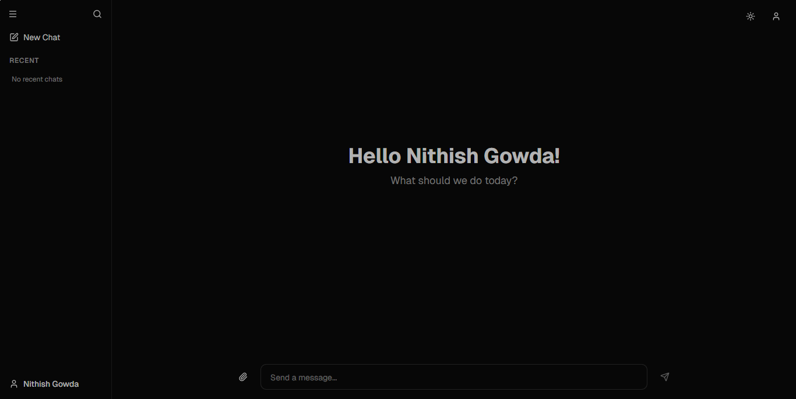
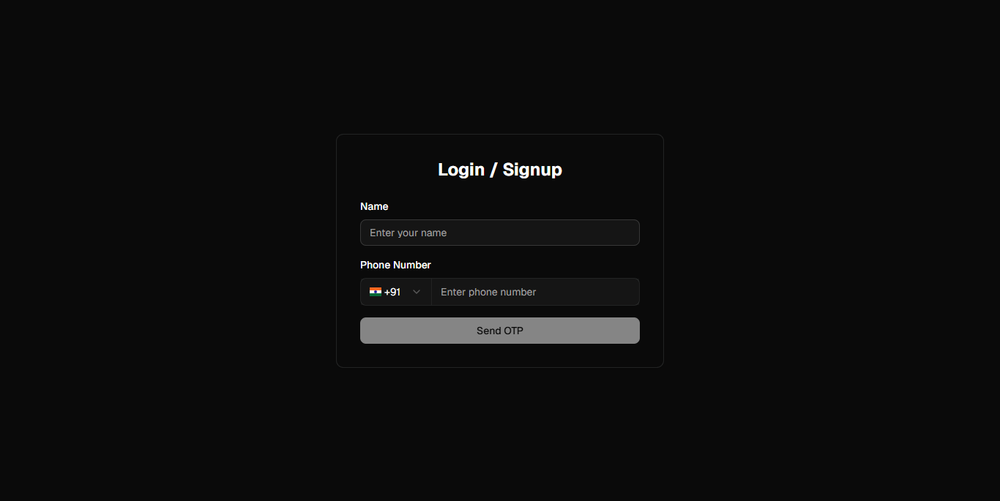
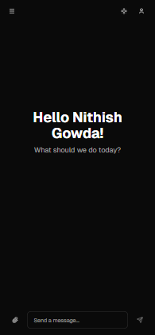

# Orion - AI Chat Application

A modern, feature-rich AI chatbot interface built with Next.js 15, TypeScript, and shadcn/ui. Experience seamless conversations with an elegant UI inspired by Gemini and Grok.

## 🚀 Live Demo

**Deployed on Vercel:** orion-chatbot.vercel.app

## 📸 Screenshots

### Chat Interface


### Login Page


### Mobile View


## ✨ Features

### 💬 Chat Interface
- **Real-time messaging** with typing indicators
- **Auto-expanding textarea** with keyboard shortcuts (Enter to send, Shift+Enter for new line)
- **Message timestamps** with relative time formatting
- **Copy-to-clipboard** functionality for AI responses
- **Image upload support** with preview and removal
- **Personalized greeting** with user's name
- **Smooth auto-scroll** to latest messages

### 🗂️ Chat Management
- **Recent chats sidebar** with up to 20 saved conversations
- **Auto-generated chat titles** from first message (40 char max)
- **Search functionality** to filter chats by title or content
- **Delete chats** with confirmation dialog
- **Persistent storage** using Zustand and localStorage

### 🎨 UI/UX
- **Dark/Light theme** toggle with system preference support
- **Responsive design** - works seamlessly on desktop, tablet, and mobile
- **Custom scrollbars** with theme-aware styling
- **Mobile-optimized** with proper viewport handling (100dvh)
- **Collapsible sidebar** with icon-only mode on desktop
- **Sheet overlay sidebar** on mobile devices

### ⚙️ Settings
- **Profile management** - Edit name and phone number
- **Theme preferences** - Switch between light and dark modes
- **Form validation** with real-time feedback
- **Toast notifications** for user actions

### 🔐 Authentication
- **Phone number authentication** with OTP verification
- **Protected routes** with authentication checks
- **Session management** with localStorage persistence

## 🛠️ Tech Stack

- **Framework:** [Next.js 15](https://nextjs.org/) with App Router & Turbopack
- **Language:** [TypeScript](https://www.typescriptlang.org/)
- **Styling:** [Tailwind CSS v4](https://tailwindcss.com/)
- **UI Components:** [shadcn/ui](https://ui.shadcn.com/) (Radix UI primitives)
- **State Management:** [Zustand](https://zustand-demo.pmnd.rs/)
- **Form Handling:** [React Hook Form](https://react-hook-form.com/) with [Zod](https://zod.dev/) validation
- **Icons:** [Lucide React](https://lucide.dev/)
- **Notifications:** [Sonner](https://sonner.emilkowal.ski/)
- **Package Manager:** [pnpm](https://pnpm.io/)

## 🚀 Getting Started

### Prerequisites

- Node.js 18+ installed
- pnpm installed (`npm install -g pnpm`)

### Installation

1. Clone the repository:
```bash
git clone https://github.com/0xnithish/orion
cd orion
```

2. Install dependencies:
```bash
pnpm install
```

3. Run the development server:
```bash
pnpm dev
```

4. Open [http://localhost:3000](http://localhost:3000) in your browser

### Build for Production

```bash
pnpm build
pnpm start
```

## 📁 Project Structure

```
orion/
├── app/                    # Next.js App Router pages
│   ├── auth/              # Authentication page
│   ├── chat/              # Chat page with URL params
│   ├── settings/          # Settings page
│   ├── layout.tsx         # Root layout with sidebar
│   ├── page.tsx           # Homepage with chat interface
│   └── globals.css        # Global styles
├── components/            # React components
│   ├── ui/               # shadcn/ui components
│   ├── app-sidebar.tsx   # Sidebar with navigation
│   ├── chat-interface.tsx # Main chat component
│   ├── layout-header.tsx # Header with theme toggle
│   └── theme-provider.tsx # Theme context provider
├── hooks/                 # Custom React hooks
│   ├── use-auth.ts       # Authentication hook
│   ├── use-auth-store.ts # Auth state management
│   └── use-chat-store.ts # Chat state management
├── lib/                   # Utility functions
│   └── utils.ts          # Helper functions
└── public/               # Static assets
    └── screenshots/      # App screenshots
```

## 🎨 Key Features Implementation

### Chat Persistence
- Chats are stored in localStorage via Zustand
- Auto-generates unique IDs for each chat
- Limits storage to 20 most recent chats (FIFO)
- Titles auto-generated from first message

### Responsive Design
- Mobile-first approach with Tailwind CSS
- Dynamic viewport height (100dvh) for mobile browsers
- Collapsible sidebar with Sheet overlay on mobile
- Touch-friendly UI elements

### Theme Support
- System preference detection
- Persistent theme selection
- Smooth transitions between themes
- Theme-aware custom scrollbars

## 🔧 Configuration

### Path Aliases
- `@/components` → `components/`
- `@/lib` → `lib/`
- `@/hooks` → `hooks/`
- `@/ui` → `components/ui/`
- `@/utils` → `lib/utils`

### Environment Variables
No environment variables required for local development.

## 📝 License

This project is open source and available under the MIT License.

## 👤 Author

**Your Name**
- GitHub: [Nithish Gowda](https://github.com/0xnithish)

## 🙏 Acknowledgments

- [shadcn/ui](https://ui.shadcn.com/) for the beautiful component library
- [Vercel](https://vercel.com/) for Next.js and hosting platform
- All the open-source libraries that made this project possible
